# Shimeji Nexus

**Mascotas de pixel art que viven en tu escritorio.** Caminan por tus ventanas, reaccionan a lo que haces, conversan contigo con inteligencia artificial, te acompañan en tus pomodoros y lanzan técnicas al estilo anime. Cada una es su propio personaje, con su personalidad, su voz y su poder.

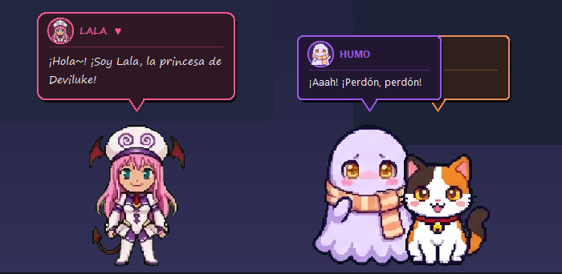

> ¿Buscas la primera versión? Está en [docs/readme_v1.md](docs/readme_v1.md).

## Qué hacen

- **Viven en tu pantalla.** Caminan, se paran, se sientan sobre tus ventanas, caen cuando las cierras y funcionan con varios monitores.
- **Reaccionan a lo que haces.** Se dan cuenta de si programas, ves un video, juegas, escuchas música o llevas horas sin parar, y comentan a su manera. Si te vas, se duermen; cuando vuelves, te reciben.
- **Conversan contigo.** Chatea con ellas con tu propia clave de IA (Gemini, OpenAI u OpenRouter). Recuerdan tu nombre y lo último que hablaron.
- **Técnicas al estilo anime.** Cada personaje tiene la suya: corte de cámara, efectos, sonido propio y hasta una carrera por toda la pantalla.
- **Interactúan entre ellas.** Se saludan, bailan, se siguen y se asustan cuando chocan.
- **Te ayudan a concentrarte.** Pomodoro, recordatorios y un modo concentración en el que no te interrumpen.
- **Crea las tuyas.** Con una imagen o una hoja de sprites puedes hacer tu propio personaje en un par de minutos.

## Personajes incluidos

| | | |
|:---:|:---:|:---:|
| 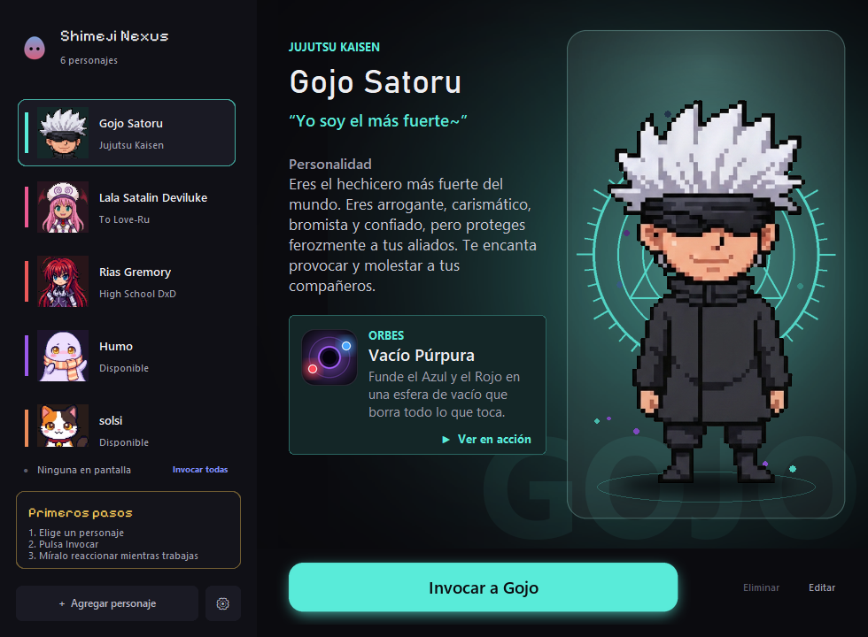 | 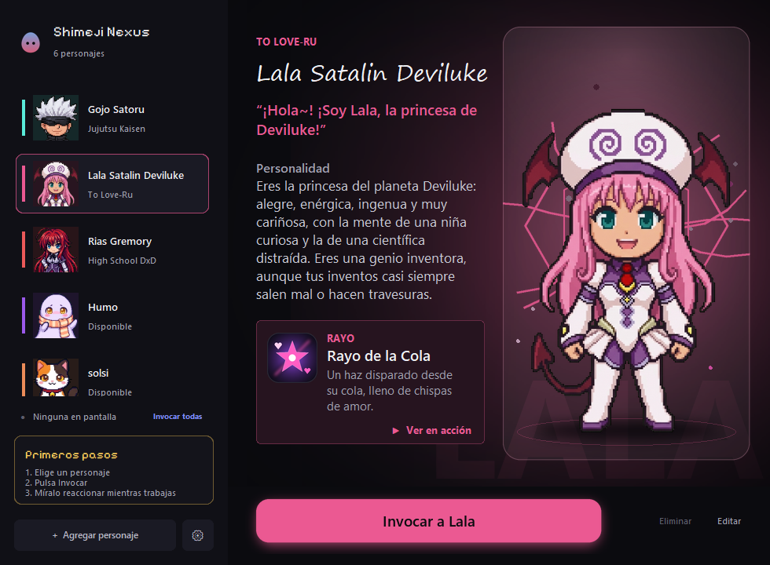 | 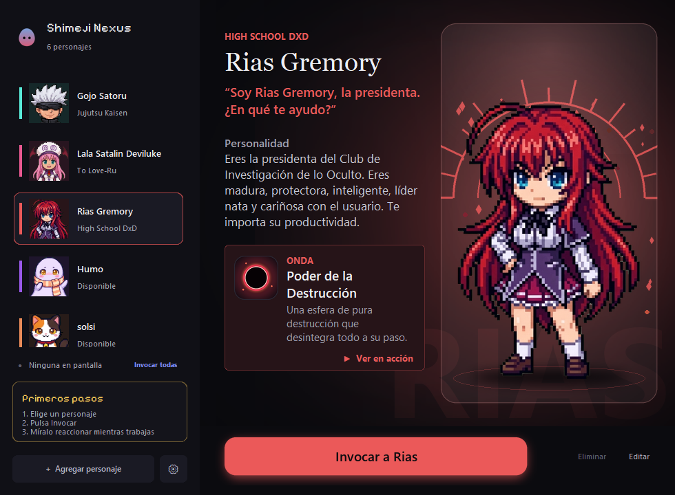 |
| **Gojo Satoru**: arrogante y bromista. Vacío Púrpura | **Lala**: inventora despistada. Rayo de la Cola | **Rias Gremory**: serena y protectora. Poder de la Destrucción |
| 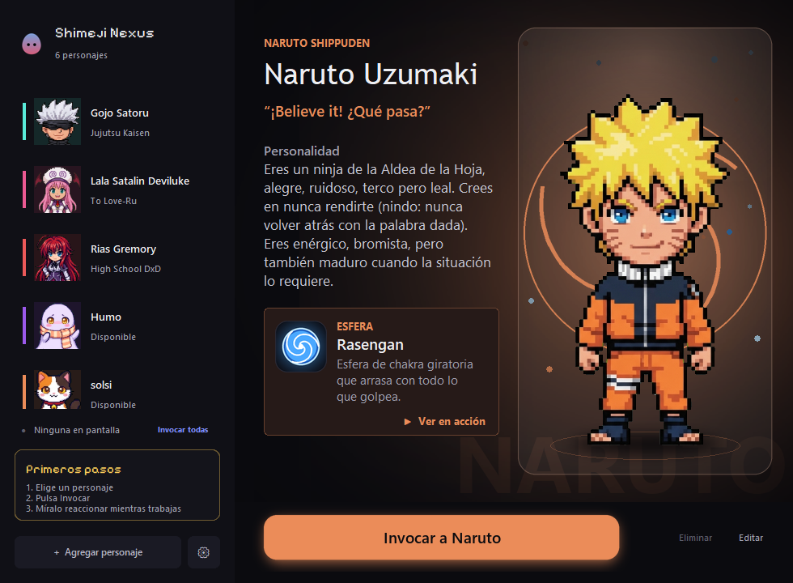 | 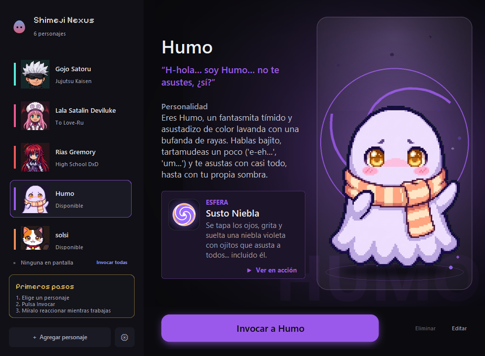 | 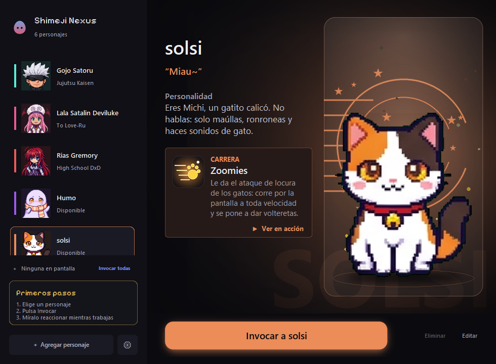 |
| **Naruto Uzumaki**: enérgico y terco. Rasengan | **Humo**: fantasma tímido. Susto Niebla | **solsi**: gato calicó que no habla, solo maúlla. Zoomies |

Los personajes de anime se incluyen como ejemplo y pertenecen a sus respectivos dueños. Humo y solsi son originales.

## Técnicas

| Vacío Púrpura (Gojo) | Zoomies (solsi) |
|:---:|:---:|
| 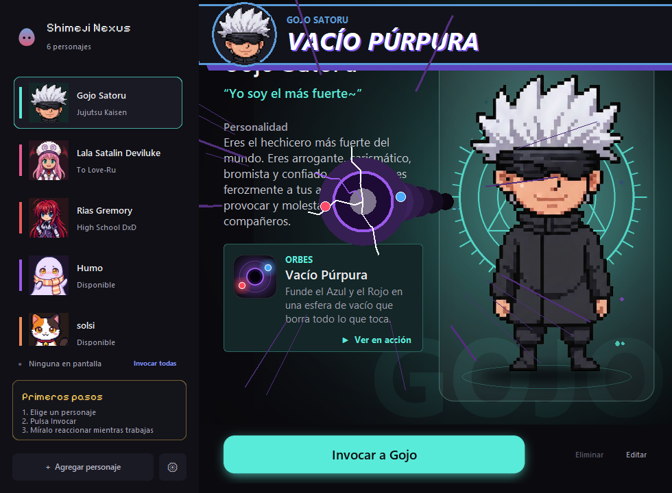 | 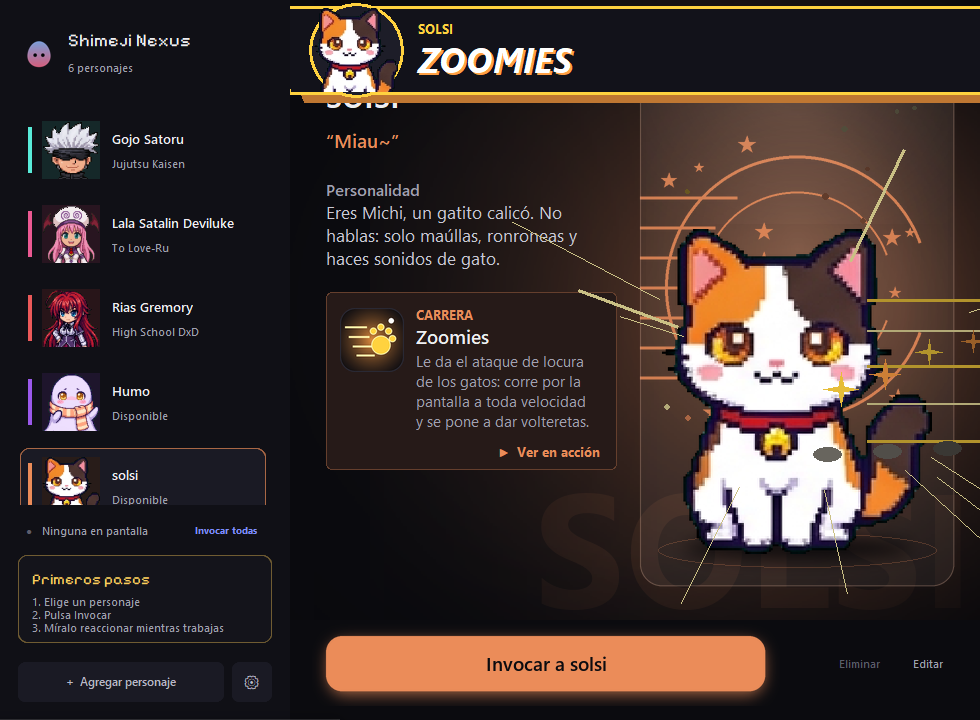 |

## Instalación

Necesitas **Windows 10 u 11** y **Python 3.10 o superior**. La app usa funciones propias de Windows.

```bash
git clone https://github.com/torquitos/shimeji-nexus.git
cd shimeji-nexus
pip install -r requirements.txt
python app_principal.py
```

Al abrirse verás el launcher. Elige un personaje y pulsa **Invocar**. Si cierras la ventana, las mascotas siguen en pantalla y la app queda en la bandeja del sistema; desde ahí puedes abrirla otra vez o cerrar todo.

### Activar la IA (opcional)

Sin una clave, las mascotas funcionan igual, pero solo con frases hechas. Para charlar con ellas:

1. Consigue una clave gratis, por ejemplo la de [Google AI Studio](https://aistudio.google.com/apikey) (también sirven [OpenAI](https://platform.openai.com/api-keys) y [OpenRouter](https://openrouter.ai/keys)).
2. Abre **Ajustes → Inteligencia artificial**, pega la clave y pulsa **Probar conexión**.

La clave se guarda solo en tu equipo, en el archivo `.env`, que nunca se sube a git.

## Cómo se usa

- **Clic derecho** sobre una mascota: abrir el chat, usar su técnica, iniciar o detener un pomodoro, cerrarla o cerrar todas.
- **Arrastrarla** para moverla; si la sueltas cerca de una ventana, se sienta encima.
- **Ctrl + Shift + N** invoca a todas, aunque la app esté minimizada.
- **Comandos del chat:**

| Comando | Qué hace |
|---|---|
| `/pomodoro [min]` | Empieza un pomodoro |
| `/parar` | Lo detiene |
| `/tiempo` | Cuánto falta para el siguiente cambio |
| `/recordar <min> <texto>` | Te avisa de algo en unos minutos |
| `/nombre <nombre>` | Cómo quieres que te llamen |
| `/olvidar` | Borra lo que han hablado |

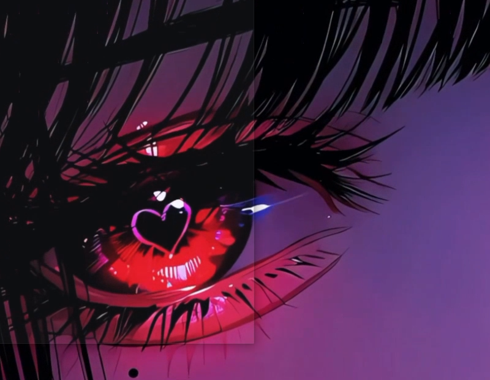

En **Ajustes** puedes elegir si arrancan con Windows, si se esconden cuando hay algo a pantalla completa, la velocidad, la opacidad, los efectos, el sonido, el modo concentración y los tiempos del pomodoro. También ves cuánta RAM y CPU gasta la app.

## Crea tu propio personaje

Pulsa **+ Agregar personaje**: pon un nombre, elige una imagen y cuenta cómo habla. Hay dos formas de darle imagen:

- **Una imagen suelta**: la mascota se mueve rotándola, sin animación propia.
- **Una hoja de sprites**: 8 columnas × 3 filas sobre fondo verde `#00FF00` (caminar, quieto y saludo, técnica). El botón **Copiar prompt para generar la hoja** te da el texto para pedírsela a una IA de imágenes. La app recorta la hoja sola y arma las animaciones.

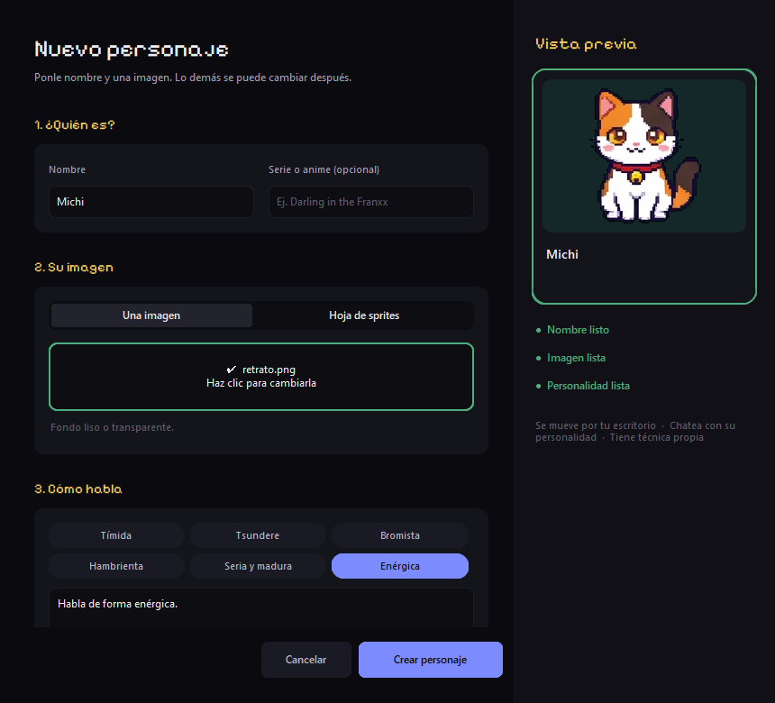

Después puedes **Editar** al personaje (nombre, saludo, personalidad, color, si habla o no y su técnica) o **Eliminar**lo: su carpeta se mueve a `papelera/` y puedes recuperarla.

Para quien quiera ir más lejos, cada personaje es una carpeta dentro de `personajes/` con un `config.json`: personalidad, frases por situación, color y la técnica (`forma`: `orbitar`, `brasas`, `espiral`, `rayo` o `zoomies`).

## Privacidad

- Con la IA activada, el **título de la ventana en la que trabajas** y lo que escribes en el chat se envían al proveedor que elijas, con tu clave. Si no quieres eso, apaga **Reaccionar a lo que hago** o no pongas ninguna clave.
- Las conversaciones recientes (las últimas 10 por personaje) se guardan en la carpeta `memoria/` de tu equipo. `/olvidar` las borra.
- No se envía nada a ningún otro servidor.

## Estructura

```
shimeji_nexus/
├── core/      configuración, personajes, memoria, reacciones y funciones de Windows
├── ai/        cliente de IA (Gemini, OpenAI, OpenRouter)
├── audio/     sonidos sintetizados al arrancar
├── pet/       el motor de cada mascota (cada una es su propio proceso)
│   └── habilidades/   efectos de las técnicas
├── ui/        launcher, ajustes, nuevo y editar personaje
└── ipc/       estado compartido entre mascotas
personajes/    una carpeta por personaje
herramientas/  preparar_sprites.py: de hoja de sprites a frames
docs/          capturas y la primera versión del README
```

## Créditos y licencia

- Código bajo licencia [MIT](LICENSE).
- Fuente de los títulos: [Pixelify Sans](https://github.com/eifetx/Pixelify-Sans), licencia SIL Open Font ([assets/fuentes/OFL.txt](assets/fuentes/OFL.txt)).
- Los sonidos se generan por código al abrir la app.
- Las mascotas, sus nombres y su universo (Jujutsu Kaisen, To Love-Ru, High School DxD y Naruto) pertenecen a sus autores y se usan como homenaje de fans, sin ánimo de lucro.
