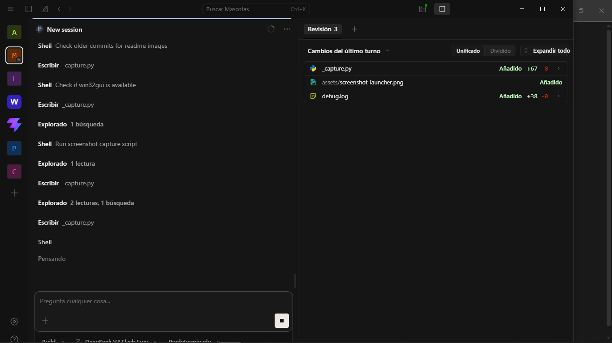
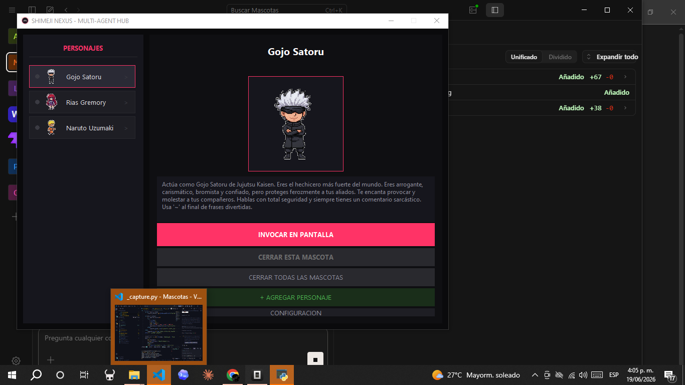

# Shimeji Nexus - Mascotas de escritorio con IA

Aplicación de mascotas interactivas en el escritorio con inteligencia artificial. Las mascotas pueden caminar, saludar, interactuar entre sí y mantener conversaciones usando Gemini, OpenAI u OpenRouter.

## Requisitos

- Python 3.10 o superior
- Windows (usa `pygetwindow` para posicionamiento en pantalla)

## Instalación

```bash
# Clonar o copiar la carpeta, luego instalar dependencias
pip install -r requirements.txt
```

## Configuración de API (obligatorio para IA)

Crear un archivo `.env` en la raíz del proyecto con al menos una de estas claves:

```env
# Proveedor por defecto (gemini, openai, openrouter)
AI_PROVIDER=gemini

# Tu API key según el proveedor que uses
GEMINI_API_KEY=tu_clave_aqui
# OPENAI_API_KEY=tu_clave_aqui
# OPENROUTER_API_KEY=tu_clave_aqui
```

- **Gemini**: obtener en https://aistudio.google.com/apikey
- **OpenAI**: obtener en https://platform.openai.com/api-keys
- **OpenRouter**: obtener en https://openrouter.ai/keys

> `AI_PROVIDER` por defecto es `gemini`. Si usás otro, cambiá el valor y asegurate de tener la key correspondiente.

## Cómo ejecutar

```bash
python app_principal.py
```

Se abre un launcher con la lista de personajes disponibles. Seleccioná uno y presioná **INVOCAR EN PANTALLA**.

## Capturas

| Launcher | Mascota en pantalla |
|----------|---------------------|
|  |  |

## Controles

- **INVOCAR EN PANTALLA** – abre la mascota flotante sobre el escritorio
- **CERRAR ESTA MASCOTA** – cierra la mascota seleccionada
- **CERRAR TODAS LAS MASCOTAS** – termina todos los procesos
- **+ AGREGAR PERSONAJE** – añadir un nuevo personaje (carpeta + config.json)
- **CONFIGURACION** – ajustar monitoreo IA, partículas, sonido, transparencia y velocidad

## Personajes incluidos

| Personaje | Imágenes | Descripción |
|-----------|----------|-------------|
| Rias Gremory | 3 (quieto, caminando, saludo) | La Reina del Consejo Estudiantil |
| Gojo Satoru | 3 (quieto, caminando, saludo) | El Hechicero más Fuerte |
| Naruto Uzumaki | 1 | El ninja más ruidoso de Konoha |

### Agregar personajes personalizados

1. Crear una carpeta dentro de `personajes/`
2. Agregar un `config.json` con este formato:
   ```json
   {
     "nombre": "Mi Personaje",
     "personalidad": "Descripción de su personalidad...",
     "imagen": "mi_imagen.png"
   }
   ```
3. Colocar las imágenes (PNG con fondo blanco para transparencia automática)
   - Una sola imagen: se usa para quieto, caminando y saludo
   - Tres imágenes: `{nombre}_quieto.png`, `{nombre}_caminando.png`, `{nombre}_saludo.png`

## Notas

- El icono de bandeja (tray icon) es opcional (`pystray`). Si no está instalado, se omite silenciosamente.
- Los sonidos se generan automáticamente al iniciar (WAV sintetizados vía `sound_manager.py`).
- `.env` está en `.gitignore` — las claves API nunca se suben al repositorio.
- No se distribuye como `.exe` (Windows Defender bloquea PyInstaller). Se ejecuta siempre desde código fuente.

## Estructura del proyecto

```
Mascotas/
├── app_principal.py       # Launcher con lista de personajes
├── mascota_motor.py       # Motor de la mascota flotante
├── ai_manager.py          # Abstracción multi-provider (Gemini/OpenAI/OpenRouter)
├── sound_manager.py       # Generación y reproducción de sonidos
├── settings_manager.py    # Persistencia de configuración
├── requirements.txt       # Dependencias
├── personajes/            # Carpetas de personajes (Gojo, Rias, naruto/)
├── assets/sounds/         # Archivos de sonido generados
├── shared_state/          # Estado compartido para interacción entre mascotas
└── .env                   # Configuración de API keys (no se sube a git)
```
