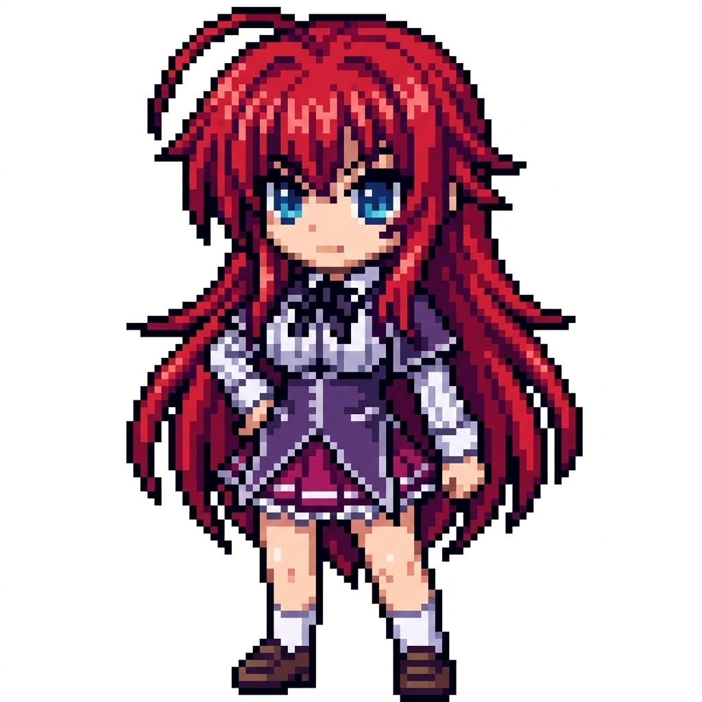
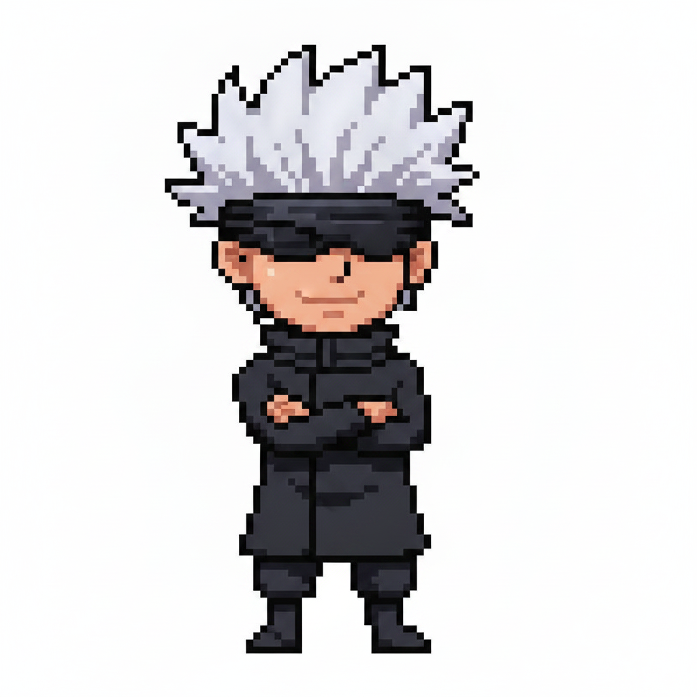
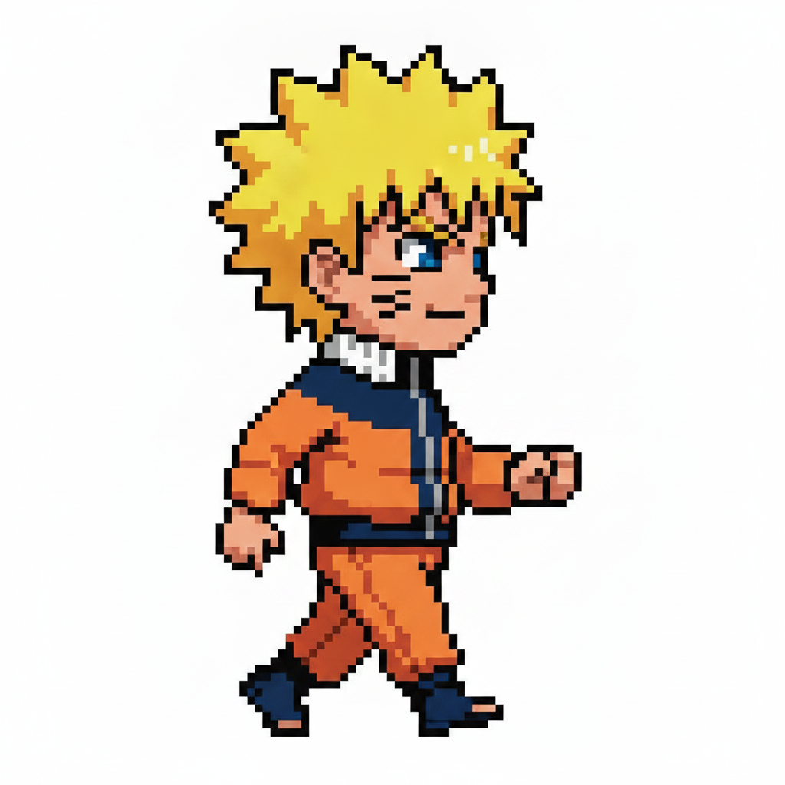

<p align="center">
  
  
  
</p>

<h1 align="center">SHIMEJI NEXUS</h1>
<p align="center">Mascotas virtuales de escritorio con inteligencia artificial</p>

<p align="center">
  <b>Python</b> + <b>Google Gemini</b> + <b>Tkinter</b>
</p>

---

## Personajes incluidos

<p align="center">
  <table>
    <tr>
      <td align="center"><br><b>Rias Gremory</b><br><sub>High School DxD</sub></td>
      <td align="center"><br><b>Gojo Satoru</b><br><sub>Jujutsu Kaisen</sub></td>
      <td align="center"><br><b>Naruto Uzumaki</b><br><sub>Naruto Shippuden</sub></td>
    </tr>
  </table>
</p>

---

## Caracteristicas

| | |
|---|---|
| **Multiples mascotas** | Varias en pantalla al mismo tiempo, interactuando entre si |
| **IA integrada** | Cada mascota comenta lo que haces en tu PC y puede chatear contigo |
| **Interaccion entre ellas** | Se saludan, bailan, se siguen y chocan entre si |
| **Animaciones por estado** | Cada personaje puede tener 3 imagenes: quieto, caminando, saludo |
| **Sonidos** | Efectos al invocar, cerrar, saludar y usar magia |
| **Panel de configuracion** | Transparencia, velocidad, particulas, monitoreo IA |
| **Bandeja de sistema** | La app se minimiza a la bandeja de Windows |
| **Agregar personajes** | Desde el launcher sin editar archivos |
| **Persistencia** | Las mascotas recuerdan su posicion al cerrarse |

---

## Descarga rapida (ejecutable)

```
1. Descarga ShimejiNexus.exe
2. Colocalo en una carpeta junto a personajes/ y assets/
3. Crea un archivo .env con tu API key
4. Ejecuta ShimejiNexus.exe
```

### Obtener API Key (gratis)

```
1. Ve a https://aistudio.google.com/apikey
2. Inicia sesion con tu cuenta de Google
3. Genera una API Key
4. Crea un archivo .env en la misma carpeta que el .exe con:
```

```env
GEMINI_API_KEY=tu_api_key_aqui
```

---

## Como usar

<p align="center">
  
  <b>1. Abre el launcher</b><br>
  Se mostrara la lista de personajes disponibles a la izquierda.<br><br>
  <b>2. Selecciona un personaje</b><br>
  Haz clic en su tarjeta para ver su informacion y previsualizacion.<br><br>
  <b>3. Invocalo en pantalla</b><br>
  Presiona el boton rosa y la mascota aparecera en tu escritorio.
</p>

<br clear="all">

### Controles de mascota

| Accion | Resultado |
|---|---|
| Clic izquierdo + arrastrar | Mueve la mascota |
| Clic derecho | Menu contextual (chat, magia, cerrar) |
| Escribir en el chat + Enter | Hablar con la IA |
| Btn INVOCAR | La mascota aparece en pantalla |
| Btn CERRAR ESTA MASCOTA | Cierra la mascota seleccionada |
| Btn CERRAR TODAS | Cierra todas las mascotas |

---

## Agregar nuevos personajes

### Desde el launcher (recomendado)

Haz clic en **+ AGREGAR PERSONAJE** y completa:

1. **Nombre** del personaje
2. **Anime** de origen (opcional)
3. **Imagen Quieto** (obligatorio, formato PNG)
4. **Imagen Caminando** (opcional)
5. **Imagen Saludo** (opcional)
6. **Personalidad** para la IA (se autogenera si la dejas vacia)

### Manualmente

Crea una carpeta en `personajes/` con esta estructura:

```
personajes/
  MiPersonaje/
    quieto.png
    caminando.png   (opcional)
    saludo.png      (opcional)
    config.json
```

```json
{
    "nombre": "Mi Personaje",
    "personalidad": "Instrucciones de personalidad para la IA",
    "frames": {
        "quieto": "quieto.png",
        "caminando": "caminando.png",
        "saludo": "saludo.png"
    },
    "imagen": "quieto.png",
    "saludo": "¡Hola! Soy Mi Personaje~"
}
```

Si solo tienes una imagen, omite `frames` y usa solo `imagen`.

---

## Requisitos (ejecutar desde codigo fuente)

```bash
pip install pillow google-genai pygetwindow python-dotenv pystray pygame psutil
```

```bash
python app_principal.py
```

---

## Estructura del proyecto

```
ShimejiNexus/
  app_principal.py     # Launcher principal
  mascota_motor.py     # Motor grafico de mascotas
  sound_manager.py     # Generacion y reproduccion de sonidos
  settings_manager.py  # Configuracion persistente
  personajes/          # Carpeta de personajes
    Rias/
    Gojo/
    naruto/
  assets/sounds/       # Efectos de sonido
  pos_cache/           # Posiciones guardadas
  shared_state/        # Comunicacion entre mascotas
```

---

## Notas

- Las mascotas se comunican entre si a traves de archivos JSON en `shared_state/`
- Si cierras el launcher, las mascotas siguen activas. Usa "CERRAR TODAS" para limpiarlas
- Para cambiar la personalidad de un personaje, edita su `config.json`
- Los sonidos se generan automaticamente en la primera ejecucion
